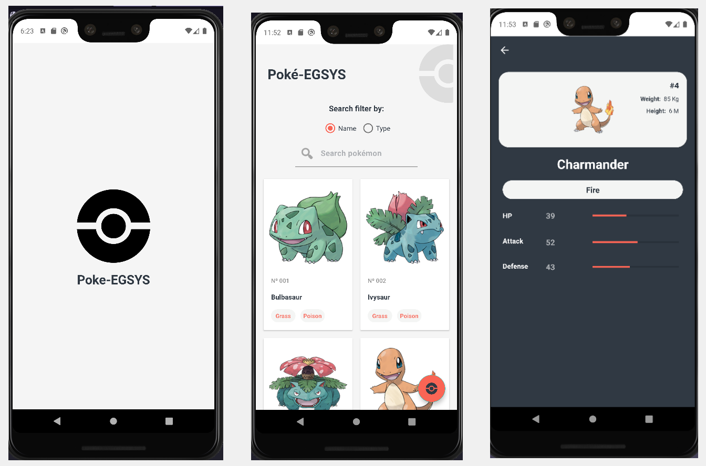

# Pokédex-EGSYS

## Aplicativo de desafio para vaga na EGSYS de Desenvolvedor Android.

</br>

<h2 align="center"> 
	🚧   Pokédex-EGSYS 🚀 Status: Finalizado.  🚧
</h2>

</br>
<p align="center">
 <a href="#tecnologias">Tecnologias</a> • 
 <a href="#autor">Autor</a> •
 <a href="#funcionalidades">Funcinoalidades</a>
</p>

</br>
<h3 id="funcionalidades">Funcionalidades e Requisitos</h3>
<li>Filtros por nome e tipo do Pokémon</li>
<li>Botão para sortear um pokémon aleatoriamente e abrir seus detalhes</li>
<li>Splash Screen</li>
<li>Tela Home</li>
<li>Tela Detalhes de um pokémon</li>
<li>API fornecida para uso: <a target="_blank" href="https://pokeapi.co">PokéAPI</a></li>

</br>
<h1 align="center">
  
</h1>

</br>
<h3 id="tecnologias">Tecnologias</h3>
<li>Kotlin</li>
<li>MVVM</li>
<li>Glide</li>
<li>Retrofit</li>

</br>
<h3 id="autor">Autor</h3>
<li>Brunno González Anjos</li>

</br>
### 🎲 Rodando o Aplicativo

```bash
# Clone este repositório
$ git clone <https://github.com/BrunnoBird/Desafio_EGSYS-Pokemon.git>

# Acesse a pasta do projeto e execute no Android Studio ✅

```
